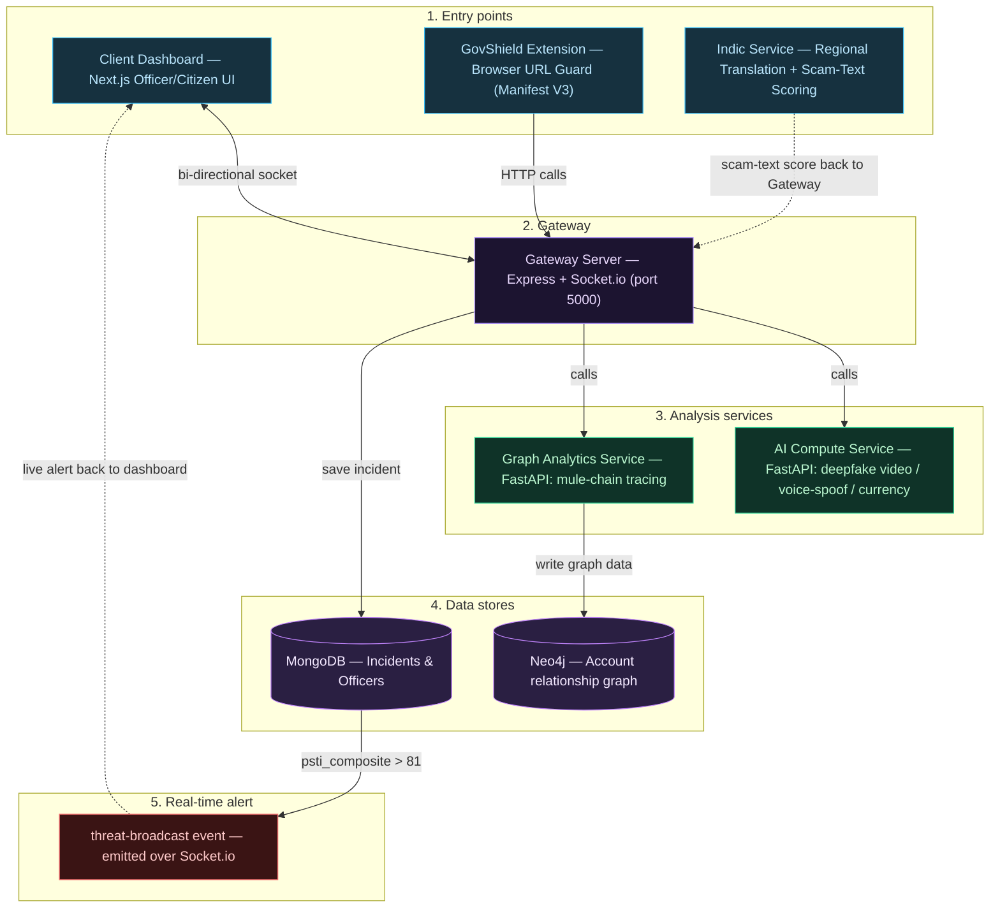

# Cyber-Defensive-Core: An AI-Powered Digital Public Safety Intelligence Platform

## Abstract

Generative-AI-enabled fraud — voice clones, deepfake video, phishing portals, counterfeit currency, and coercive "Digital Arrest" scams impersonating agencies such as the CBI, ED, and local police — has become one of India's fastest-growing cybercrime categories, with Digital Arrest scams alone reported to have caused losses exceeding ₹1,776 crore in the first nine months of 2024. Existing defenses are fragmented: a phishing filter cannot verify a voice clip, a deepfake detector cannot check a currency note, and cybercrime reporting portals only become useful *after* a citizen has already lost money.

This repository implements **Cyber-Defensive-Core**, an end-to-end prototype that unifies five independent AI verification capabilities — voice-spoof detection, deepfake video detection, counterfeit currency verification, scam-text/URL detection, and browser-level fake-government-site blocking — behind a single citizen-facing verification layer, while simultaneously streaming every verified incident into a Cyber Command Center for law enforcement. The system is built as a set of independently deployable microservices (a Node.js/Express gateway, a Python/FastAPI AI compute core, a Python/FastAPI graph-analytics service backed by Neo4j, a Next.js officer/citizen dashboard, and a Manifest V3 Chrome extension), so that each detection capability can be scaled, retrained, or replaced without touching the others.

---

## 1. Motivation and problem statement

Cybercrime aimed at individuals increasingly exploits human trust rather than software vulnerabilities. Three gaps motivated this project:

1. **No unified verification surface.** A citizen who receives a suspicious call, video, message, currency note, or link has no single place to check all of them — they must trust intuition or rely on disconnected, single-purpose tools.
2. **Reactive investigation, not prevention.** Cybercrime portals and helplines act only after a complaint is filed — typically after money has already moved.
3. **Isolated complaints, invisible patterns.** Individual reports rarely get cross-referenced, so coordinated scam campaigns (repeated phishing domains, mule-account chains, voice-cloning clusters) go undetected until they have scaled significantly.

Cyber-Defensive-Core addresses these gaps with a **Citizen Verification Layer** (upload/record/paste content, get an explainable AI verdict in seconds) feeding a **Cyber Command Center** (an officer-facing console that aggregates verdicts, traces mule-account chains through a graph database, and broadcasts real-time critical alerts).

---

## 2. System architecture

### 2.1 Logical layers

The platform is organized into five tiers, matching the five top-level services in this repository:

- **Entry points.** The citizen/officer web dashboard (Next.js), the GovShield browser extension (Manifest V3, runs independently of the backend), and the Indic vernacular-text service.
- **Gateway layer.** A single Express.js + Socket.io server that authenticates officers, persists incidents, orchestrates calls to the AI and graph services, and pushes real-time alerts to connected dashboards.
- **Analysis services.** Two independently deployable Python/FastAPI services — the AI Compute Service (deepfake video, voice-spoof, and currency models) and the Graph Analytics Service (Neo4j-backed mule-chain tracing).
- **Data stores.** MongoDB for incidents and officer accounts; Neo4j (AuraDB) for the account-transaction relationship graph.
- **Real-time alerting.** A `threat-broadcast` Socket.io event emitted whenever an incident's composite threat score crosses the critical threshold, delivered live to every connected dashboard.

### 2.2 Architecture diagram



### 2.3 Design invariant

> The Gateway Server is the single writer of `threat_scores.psti_composite` and `verdict_state`. Every downstream consumer — the officer dashboard's incident table, the map view, the real-time alert banner — reads the same composite score computed once in `incidentController.js`, so the whole system stays consistent with one source of truth per incident.

---

## 3. Detection modules

Each detection capability is a domain-specific pipeline rather than a single generalized model, so each can be optimized, scaled, and retrained independently.

| Module | Objective | Pipeline | Model(s) |
| --- | --- | --- | --- |
| Voice-spoof detection | Flag AI-cloned / synthetic voices used in Digital Arrest and vishing calls | Audio upload → resample → feature extraction → classification → confidence score | `wav2vec2`-based audio classifier (`garystafford/wav2vec2-deepfake-voice-detector`) |
| Deepfake video detection | Identify AI-generated or manipulated video impersonating officials or trusted individuals | Video upload → every-Nth-frame extraction (OpenCV) → image classification per frame → aggregated confidence | DeiT / Vision-Transformer-family image classifier (`sakshamkr1/deitfake-v2`), INT8-quantized for CPU inference |
| Counterfeit currency detection | Verify Indian currency notes from a photo | Image upload → edge-density & regional-variance heuristics → ORB denomination matching → OCR text verification → authenticity verdict | OpenCV heuristics + ORB feature matching + Tesseract OCR |
| Scam-text / vernacular threat detection | Score SMS/chat/email text for scam and coercion patterns, including regional languages | Text → language detection → translation (IndicTrans2) → phrase-pattern scoring | IndicTrans2-based translator + rule/pattern scorer |
| Fake government website detection | Block phishing portals that mimic government domains before the user submits data | URL visited → domain allow-list check → homograph normalization → Levenshtein typosquat distance → warning banner | Client-side heuristic engine (no backend round-trip required) |
| Mule-chain / network analytics | Trace multi-hop, laundering-linked account chains | Seed accounts with a laundering-tagged transaction → bounded 2–4-hop Cypher path search → chain velocity scoring | Neo4j Cypher path queries over the IBM AML synthetic dataset |

### 3.1 Composite threat scoring

The Gateway Server combines signals from the AI Compute Service and the Graph Analytics Service into a single **PSTI (Public Safety Threat Index) composite score**, and maps it to a four-tier verdict:

```
psti_composite = 0.30 * deepfake_score
               + 0.20 * voice_spoof_score
               + 0.20 * psychological_script_score
               + 0.30 * network_velocity_score
```

| PSTI range | Verdict | Behavior |
| --- | --- | --- |
| 0 – 30 | `LOW` | Logged, no alert |
| 31 – 60 | `MEDIUM` | Visible in dashboard incident table |
| 61 – 81 | `HIGH` | Flagged for officer review |
| > 81 | `CRITICAL` | Persisted **and** broadcast live via the `threat-broadcast` Socket.io event to every connected dashboard |

Repeated phishing-URL reports follow a parallel rule: a URL accumulates a `report_count`, and once three independent reports land on the same flagged URL, it is auto-escalated to `CRITICAL` and broadcast the same way.

---

## 4. Application layer

| Surface | Stack | Purpose |
| --- | --- | --- |
| Citizen Sandbox | Next.js (App Router), TypeScript, Tailwind CSS | Deepfake / voice / currency / scam-text / website checks for the public |
| Cyber-Cell Console | Next.js, `@tremor/react`, `react-leaflet` | Officer login, live incident map, mule-chain trace lookup, case management, analytics & trends |
| GovShield Extension | Chrome Extension (Manifest V3), vanilla JS | Background service worker that checks every visited domain against an allow-list and a homograph/typosquat detector, independent of backend uptime |
| Real-time layer | Socket.io client/server | Bi-directional link between the Gateway and the dashboard for live `threat-broadcast` alerts |

The frontend consumes a single centralized config module (`client-dashboard/src/lib/config.ts`) that resolves every backend URL from environment variables, so switching between local development and deployed services never requires touching component code.

---

## 5. Infrastructure

| Component | Technology | Notes |
| --- | --- | --- |
| Gateway / API | Node.js, Express.js, Socket.io | REST endpoints + real-time broadcast, JWT auth via httpOnly cookie |
| AI Compute Core | Python, FastAPI, PyTorch, Transformers, OpenCV, Tesseract | Deepfake video, voice-spoof, and currency verification; models loaded once at startup via FastAPI `lifespan` |
| Graph Analytics | Python, FastAPI, Neo4j Python driver | Cypher-based mule-chain search over an AuraDB free-tier graph |
| Vernacular / text service | Python, FastAPI, IndicTrans2 | Scam-text scoring with regional-language support (Hindi, Tamil, Telugu, Marathi, Bangla) |
| Primary datastore | MongoDB (Mongoose ODM) | Incidents, officer accounts |
| Graph datastore | Neo4j AuraDB | Account transaction relationship graph, seeded from the IBM AML synthetic dataset |
| Browser security | Chrome Extension APIs (Manifest V3) | `declarativeNetRequest`, `webNavigation`, `scripting` permissions; runs entirely client-side |
| Auth | JWT (httpOnly cookie), bcrypt | Officer login only — citizen flows are anonymous/session-based |

---

## 6. API surface

### 6.1 Gateway Server (`gateway-server`, default port `5000`)

| Method | Endpoint | Auth | Purpose |
| --- | --- | --- | --- |
| GET | `/api/v1/health` | — | Liveness check |
| POST | `/api/v1/incident` | — | Create an incident; orchestrates calls to the AI Compute Service and Graph Analytics Service, computes `psti_composite`, persists to MongoDB, broadcasts if critical |
| POST | `/api/v1/url-check` | — | Report a suspicious URL from the browser extension; auto-escalates after repeated reports |
| GET | `/api/v1/incident/:id` | Officer (JWT cookie) | Fetch a single incident |
| GET | `/api/v1/incidents` | Officer (JWT cookie) | Paginated incident list (`page`, `limit` query params) |
| PATCH | `/api/v1/incident/:id` | Officer (JWT cookie) | Update `case_status` / `assigned_officer` |
| POST | `/api/v1/auth/login` | — | Officer login, sets httpOnly JWT cookie |
| POST | `/api/v1/auth/logout` | — | Clears the auth cookie |

**Socket.io event — `threat-broadcast`** (emitted when `psti_composite > 81`):

```json
{
  "session_uuid": "string",
  "incidentType": "deepfake | mule | voice | currency | url_phishing",
  "psti_composite": 0,
  "verdict_state": "CRITICAL",
  "location": { "lat": 0.0, "lng": 0.0 },
  "timestamp": "ISODate"
}
```

### 6.2 AI Compute Service (`ai-compute-service`, default port `8000`)

| Method | Endpoint | Input | Output |
| --- | --- | --- | --- |
| GET | `/api/v1/health` | — | Service status |
| POST | `/api/v1/ai/analyze/deepfake` | Video file (`.mp4/.mov/.avi/.webm/.mkv`, ≤300MB) | `isDeepfake`, `confidence`, `framesAnalyzed`, `lowResolutionWarning` |
| POST | `/api/v1/ai/analyze/voice` | Audio file (`.wav/.mp3/.flac/.ogg/.m4a/.mp4`, ≤30MB) | `isSpoofed`, `spoofConfidence`, `durationSeconds` |
| POST | `/api/v1/ai/analyze/currency` | Image file (`.jpg/.jpeg/.png/.bmp/.webp`, ≤20MB) | `isAuthentic`, `confidenceScore`, `matchedDenomination`, `textVerified`, `flaggedRegions` |

### 6.3 Graph Analytics Service (`graph-analytics`, default port `8002`)

| Method | Endpoint | Auth | Purpose |
| --- | --- | --- | --- |
| POST | `/api/v1/graph/analyze` | — | Compute a `network_velocity_score` (`lviScore`) for an incident, called internally by the Gateway |
| POST | `trace-mule` route (see `main.py`) | Officer (JWT cookie, shared secret with Gateway) | Search 2–4 hop laundering-linked account chains from a given account number |

### 6.4 Indic Service (`indic_service`, default port `8001`)

| Method | Endpoint | Input | Output |
| --- | --- | --- | --- |
| POST | `/api/v1/ai/analyze/text` | `{ session_uuid, text, lang_code }` (`hin_Deva`, `tam_Taml`, `tel_Telu`, `mar_Deva`, `ben_Beng`) | `psychological_script_score`, `detected_phrases`, `translated_text` |

---

## 7. Database schema

### 7.1 MongoDB (`gateway-server/models`)

**`Incident`**

| Field | Type | Notes |
| --- | --- | --- |
| `session_uuid` | String, unique | Client-generated session identifier |
| `citizen_phone_hash` | String | Hashed contact identifier, never raw PII |
| `incidentType` | Enum | `deepfake`, `mule`, `voice`, `currency`, `url_phishing` |
| `location` | `{ lat, lng }` | Optional geolocation |
| `threat_scores` | Object | `deepfake_score`, `voice_spoof_score`, `psychological_script_score`, `network_velocity_score`, `psti_composite` |
| `verdict_state` | Enum | `LOW`, `MEDIUM`, `HIGH`, `CRITICAL` |
| `flagged_url`, `detection_reason`, `report_count` | — | Used by the `url_phishing` flow |
| `case_status` | Enum | `OPEN`, `IN_PROGRESS`, `RESOLVED`, `ESCALATED` |
| `assigned_officer` | String | Officer email/id |
| `timestamp` | Date | Defaults to creation time |

**`Officer`**

| Field | Type | Notes |
| --- | --- | --- |
| `email` | String, unique | Login identifier |
| `password_hash` | String | bcrypt hash |
| `badge_id` | String | — |
| `department` | String | — |
| `role` | String | Defaults to `"officer"` |

### 7.2 Neo4j (`graph-analytics`)

`(:Account)-[:TRANSFERRED { amount, timestamp, is_laundering }]->(:Account)`, seeded from the IBM AML synthetic anti-money-laundering dataset (`load_ibm_aml_data.py`). Mule-chain search is deliberately bounded — it first finds the small set of accounts touching at least one laundering-tagged transaction, then only searches 2–4 hop paths starting from that reduced candidate set, to stay inside Neo4j AuraDB's free-tier memory limit.

---

## 8. Reproduction steps

Each service runs independently and reads its configuration from a local `.env` file (not committed — create one per service before running).

```bash
# 1. Clone
git clone https://github.com/GITadiiii/Cyber-Defensive-Core.git
cd Cyber-Defensive-Core

# 2. Gateway Server (Node.js — port 5000)
cd gateway-server
npm install
# .env: MONGODB_URI, JWT_SECRET, AI_SERVICE_URL, GRAPH_SERVICE_URL
npm run dev

# 3. AI Compute Service (Python/FastAPI — port 8000)
cd ../ai-compute-service
python -m venv venv && source venv/bin/activate   # Windows: venv\Scripts\activate
pip install -r requirements.txt
uvicorn main:app --reload --port 8000

# 4. Graph Analytics Service (Python/FastAPI — port 8002)
cd ../graph-analytics
python -m venv venv && source venv/bin/activate
pip install -r requirements.txt
# .env: NEO4J_URI, NEO4J_USERNAME, NEO4J_PASSWORD, JWT_SECRET
uvicorn main:app --reload --port 8002

# 5. Indic / vernacular text service (Python/FastAPI — port 8001)
cd ../indic_service
python -m venv venv && source venv/bin/activate
pip install -r requirements.txt
uvicorn main:app --reload --port 8001

# 6. Client Dashboard (Next.js — port 3000)
cd ../client-dashboard
npm install
# .env.local: NEXT_PUBLIC_API_BASE_URL, NEXT_PUBLIC_SOCKET_URL,
#             NEXT_PUBLIC_AI_SERVICE_URL, NEXT_PUBLIC_TEXT_SERVICE_URL,
#             NEXT_PUBLIC_GRAPH_SERVICE_URL
npm run dev                 # http://localhost:3000

# 7. GovShield Chrome Extension
# chrome://extensions -> Enable Developer Mode -> Load unpacked -> select govshield-extension/
```

---

## 9. Repository layout

```
Cyber-Defensive-Core/
├── gateway-server/                   Express + Socket.io API gateway (port 5000)
│   ├── server.js                     App bootstrap, CORS, Socket.io, route mounting
│   ├── config/db.js                  MongoDB connection
│   ├── controllers/
│   │   ├── incidentController.js     Orchestrates AI + Graph calls, PSTI scoring, broadcasts
│   │   └── authController.js         Officer login/logout, JWT cookie issuance
│   ├── middleware/verifyOfficer.js   JWT cookie verification for protected routes
│   ├── models/
│   │   ├── Incident.js               Incident schema
│   │   └── Officer.js                Officer schema
│   ├── routes/
│   │   ├── incidentRoutes.js
│   │   └── authRoutes.js
│   └── scripts/createOfficer.js      One-off script to seed an officer account
│
├── ai-compute-service/               FastAPI AI Compute Core (port 8000)
│   ├── main.py                       App bootstrap, model loading (lifespan), router mounting
│   ├── routes/
│   │   ├── deepfake_routes.py        Video upload → frame extraction → ViT classification
│   │   ├── voice_routes.py           Audio upload → wav2vec2 spoof classification
│   │   └── currency_routes.py        Image upload → OpenCV + ORB + OCR verification
│   ├── services/model_loader.py      HuggingFace model loading + INT8 quantization
│   ├── utils/                        video_utils, audio_utils, currency_matcher, currency_ocr
│   ├── reference_notes/              Reference currency images used for ORB matching
│   └── requirements.txt
│
├── graph-analytics/                  FastAPI Graph Analytics Service (port 8002)
│   ├── main.py                       App bootstrap, JWT cookie auth, mule-trace endpoint
│   ├── trace_mule.py                 Bounded 2-4 hop Cypher path search
│   ├── normalizer.py                 LVI → network_velocity_score normalization
│   ├── load_ibm_aml_data.py          Seeds Neo4j with the IBM AML synthetic dataset
│   ├── setup_schema.py               Neo4j schema/constraints setup
│   └── requirements.txt
│
├── indic_service/                    FastAPI vernacular scam-text service (port 8001)
│   ├── main.py                       API bootstrap, request/response models
│   ├── translator.py                 IndicTrans2-based translation + phrase scoring
│   └── requirements.txt
│
├── client-dashboard/                 Next.js citizen + officer dashboard (port 3000)
│   └── src/
│       ├── app/
│       │   ├── citizen/              Deepfake / voice / currency / scam-text / website checks
│       │   ├── (dashboard)/          Incident map, mule-trace, cases, reports, analytics
│       │   └── login/                Officer login
│       ├── components/
│       │   ├── dashboard/            AlertBanner, StatCards, PstiGaugeCircle, IncidentLookupTable
│       │   ├── layout/                Sidebar, CitizenNav
│       │   └── shared/                FileAnalyzer, ConfidenceBar, ErrorBoundary
│       └── lib/                      api.ts, config.ts, socket.ts, types.ts
│
├── govshield-extension/              Chrome Extension, Manifest V3
│   ├── manifest.json
│   ├── background.js                 Domain allow-list, homograph normalization, typosquat distance
│   ├── content.js                    In-page warning banner injection
│   └── popup.html / popup.js
│
├── API_CONTRACT.md                   Cross-team API contract (Gateway ⇄ AI ⇄ Graph)
└── README.md
```

---

## 10. Evaluation and validity

| Aspect | What to report |
| --- | --- |
| Deepfake / voice-spoof accuracy | Classifier confidence against held-out fake/real samples; frame-count and low-resolution-warning sensitivity for video |
| Currency verification | True/false positive rate across the seven reference denominations (₹10–₹2000) under the edge-density + microprint-variance heuristic, cross-checked against OCR text verification |
| PSTI calibration | Distribution of composite scores against the four verdict-tier boundaries, checked for reasonable tier balance |
| Mule-chain search correctness | Verification that returned chains only include laundering-tagged edges within the 2–4 hop, 72-hour window bound |
| URL/typosquat detection | Precision of the Levenshtein-distance + homograph-normalization check against known typosquat domains, false-positive rate against legitimate lookalike government subdomains |

**Threats to validity.** The deepfake and voice-spoof detectors are third-party pretrained classifiers (not fine-tuned on India-specific fraud call/video data); the currency heuristic combines edge/variance thresholds tuned by inspection rather than a labeled counterfeit dataset; the PSTI weighting (`0.3 / 0.2 / 0.2 / 0.3`) is a defensible starting heuristic, not one calibrated against real cybercrime case outcomes; the mule-chain graph is seeded from the IBM AML *synthetic* dataset rather than real (anonymized) transaction data.

---

## 11. Limitations and future work

- **AI Compute Service deployment.** Running the deepfake and voice-spoof models simultaneously requires roughly 1.5–2GB of RAM, which exceeds every free-tier cloud host's 512MB cap; the current demo path documents this constraint openly rather than masking it.
- **BHASHINI integration.** Registration for the official BHASHINI multilingual API is pending; the vernacular pipeline currently runs on the open-source IndicTrans2 fallback and is architecture-ready for a drop-in swap once BHASHINI access is granted.
- **PSTI weight calibration.** Composite scoring weights are a reasoned starting point, not calibrated against real investigative outcomes; a production rollout would tune them against labeled case data.
- **Real-time call protection, browser/payment protection, and telecom/banking intelligence integration** are part of the platform's long-term vision (per the hackathon submission) but are not implemented in the current prototype.
- **NCRP / national reporting integration.** Automated submission of verified incidents to the National Cyber Crime Reporting Portal is scoped as future work, pending government approval and integration availability.
- **Predictive threat intelligence.** Forecasting emerging scam campaigns from historical incident/graph data is future scope; the current graph service performs retrospective mule-chain tracing only.

